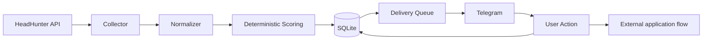
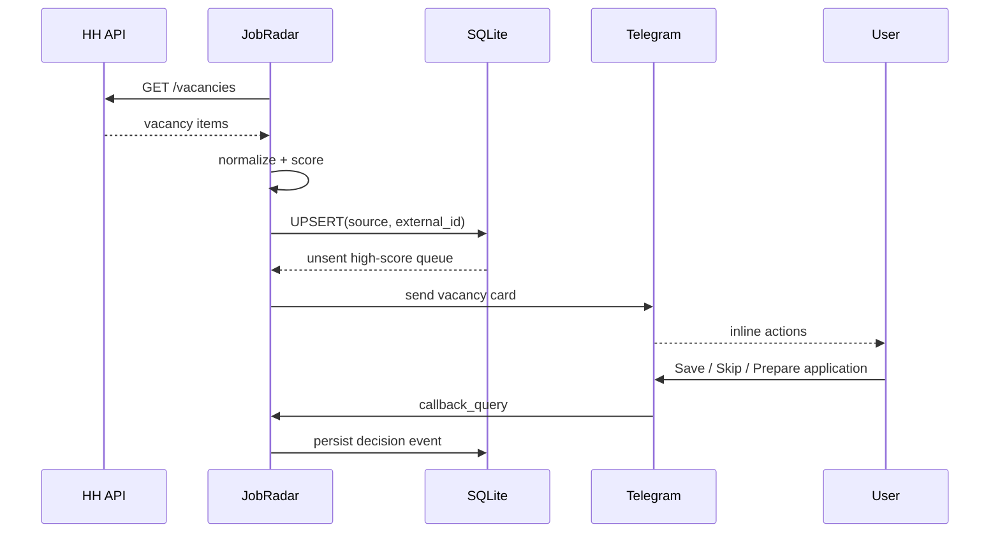
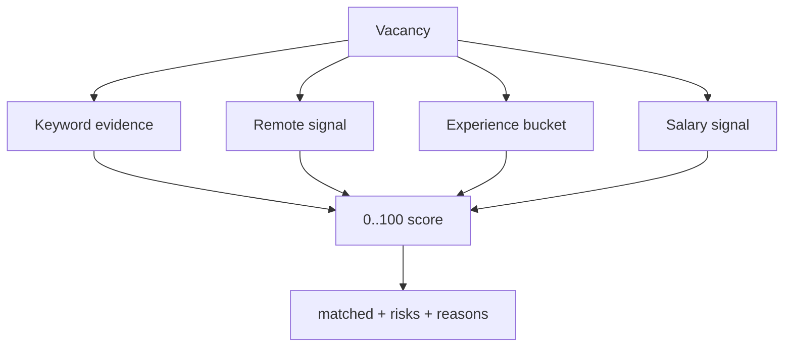
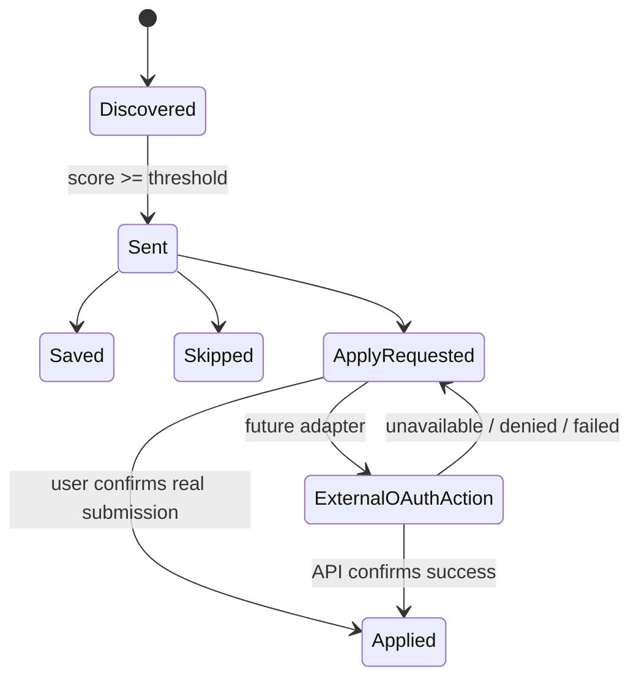

# JobRadar architecture

## Goal

Reduce vacancy noise and make the path from discovery to deliberate application short, explainable and auditable.

## System context

## Delivery sequence

## Core rules

1. `(source, external_id)` is the deduplication key.
2. A Telegram notification is marked sent only after Telegram accepts the message.
3. Scoring is deterministic and stores human-readable reasons.
4. A callback changes only JobRadar state unless an explicit external adapter is authorized.
5. Application submission must fail closed when OAuth or vacancy-specific action metadata is unavailable.
6. Runtime secrets live in environment variables, never in the repository.
7. Unknown Telegram chats cannot mutate state.

## Scoring model

The first version is deliberately transparent rather than ML-based. It rewards signals useful for junior system-analysis work and applies penalties to obviously senior roles.

A future feedback model can learn from `saved`, `skipped`, `apply_requested`, `applied`, interview and offer events, but it should remain inspectable and must not silently replace hard safety filters.

## Application boundary

The public vacancy search can run without an HH OAuth token. Applying is a separate concern.

The important invariant is that `Applied` must never mean "the bot tried". It means either the user confirmed the real submission or an authorized adapter received a successful platform response.

## Persistence

Current MVP uses SQLite to make local/VPS deployment dependency-free. The repository boundary is intentionally small so PostgreSQL can replace it later without changing scoring or Telegram behavior.

Tables:

- `vacancies` — normalized vacancy snapshot, score, delivery state and latest decision;
- `decision_events` — append-only decision history for later feedback analysis.

## Next steps

- HH applicant OAuth and vacancy-specific allowed-action discovery;
- PostgreSQL adapter and migrations;
- richer feedback reasons for skipped vacancies;
- multiple sources behind a common `VacancySource` interface;
- daily digest and quiet hours;
- application funnel: applied → viewed → interview → offer;
- optional ranking model trained only after enough real feedback exists.
