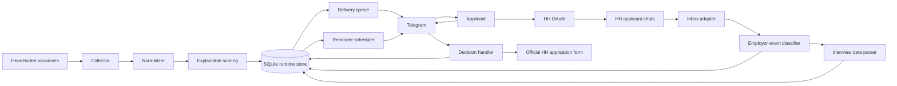
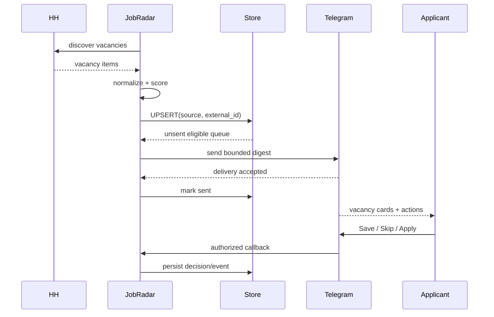
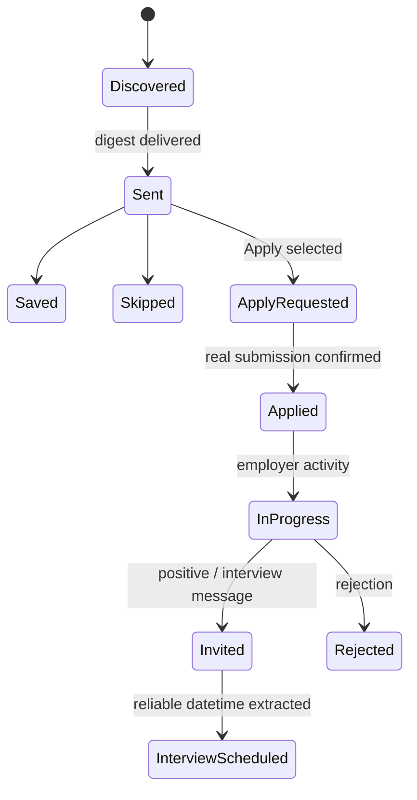
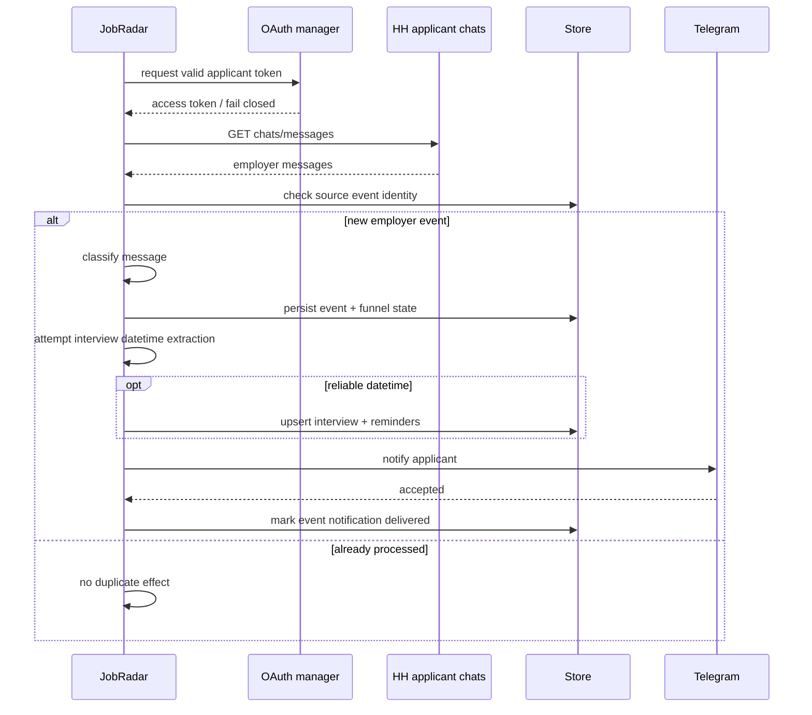

# JobRadar architecture

## Goal

Reduce vacancy noise and keep the applicant workflow — discovery, decision, application, employer response and interview — explainable, persistent and auditable.

For a requirement/use-case/data-model view, see [`docs/SYSTEM_ANALYSIS.md`](docs/SYSTEM_ANALYSIS.md).

## System context

The current application boundary is intentionally conservative: JobRadar prepares the application and opens the official HH flow, but `applied` is recorded only after explicit user confirmation. Automatic API submission remains a separate roadmap item.

## Main runtime components

| Component | Responsibility |
| --- | --- |
| `HHClient` | Vacancy discovery and source normalization inputs |
| `Vacancy` / models | Stable internal vacancy representation |
| scoring | Deterministic fit/risk evaluation with human-readable evidence |
| `VacancyStore` | Persistent vacancies, decisions, applications, employer events, interviews, reminders and runtime cursors |
| Telegram client/handlers | Owner-only UI, digests, callbacks, commands and notifications |
| `HHOAuthManager` | Applicant OAuth state, code exchange, token persistence/refresh and applicant verification |
| `HHInboxClient` | Read-only HH employer chat integration |
| employer classifier | Distinguishes ordinary messages, positive/invitation events and rejections |
| interview parser | Extracts explicit interview date/time evidence |
| reminder scheduler | Persists and delivers 24h / 2h / 30m reminders |

## Vacancy delivery sequence

If Telegram does not accept the digest, JobRadar does not mark the vacancy sent.

## Application state boundary

The key invariant is that `Applied` never means "the bot tried". Opening an application URL or generating a cover letter is not considered success.

## Employer-response sequence

## Persistence

The current runtime uses SQLite. Persistent entities are separated by responsibility:

- `vacancies` — normalized vacancy snapshot, score, delivery state and latest decision;
- `decision_events` — decision history;
- `applications` — applicant-side funnel state;
- `employer_events` — source events from employer communication;
- `interviews` — extracted scheduled interviews;
- `interview_reminders` — reminder delivery state;
- `runtime_settings` — durable cursors/configuration state such as Telegram binding and polling/digest cursors.

Key uniqueness/idempotency boundaries include `(source, external_id)` for vacancies, source event identity for employer events, and `(interview_id, kind)` for reminders.

## Security and mutation boundaries

1. The applicant's HH login/password is never collected.
2. Personal HH data requires applicant OAuth.
3. OAuth `state` is validated before code exchange.
4. Access/refresh tokens live only in the protected runtime database/environment, never in the public repository.
5. HH chat integration is read-only.
6. Unknown Telegram chats cannot mutate applicant state.
7. External application submission is not assumed successful from an attempt.
8. Missing authorization causes OAuth-only behaviour to fail closed.

## Reliability rules

1. Repeated collection does not duplicate vacancy identity.
2. Repeating the same decision does not append the same decision event again.
3. Repeated inbox polling does not duplicate employer events/notifications.
4. Interview reminders survive process restarts.
5. A reminder is marked sent only after Telegram accepts it.
6. A positive employer message without reliable date/time is still stored/notified, but no schedule is invented.
7. Collection frequency is independent from notification frequency, preventing polling cadence from becoming notification spam.

## Current vs roadmap

### Implemented

- HH vacancy discovery and normalization;
- explainable vacancy scoring;
- persistent deduplication and delivery state;
- quiet top-3 Telegram digests and evening fallback;
- Save / Skip / Apply workflow;
- structured skip reasons;
- applicant OAuth lifecycle;
- HH employer chat monitoring;
- employer response/rejection classification;
- persistent application funnel;
- interview date/time extraction;
- reminder scheduling/delivery;
- tests and CI.

### Planned

- safe one-tap HH application adapter with vacancy-specific capability checks;
- PostgreSQL repository and migrations while keeping SQLite local/demo mode;
- additional vacancy-source adapters and feedback-aware ranking.

The roadmap is intentionally not presented as already implemented functionality.
