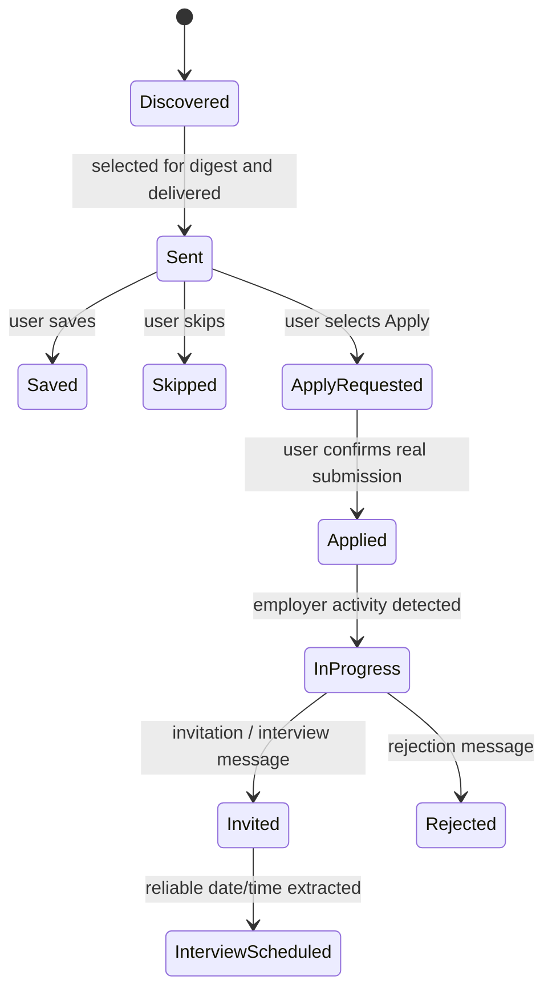
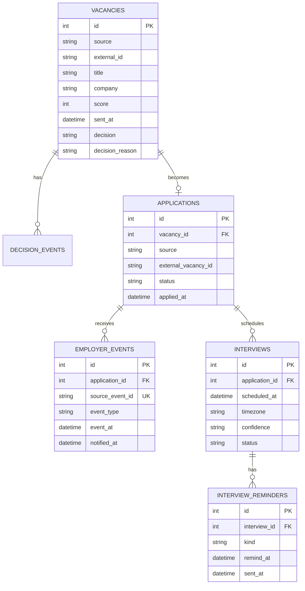

# JobRadar — system analysis case

This document describes JobRadar as a system: scope, actors, requirements, state transitions, integrations, persistence rules and failure behaviour. It is intentionally tied to the behaviour implemented in this repository.

## 1. Problem and goal

Vacancy search produces a large stream of mostly irrelevant items, while the useful workflow continues after the vacancy is found: review, decision, application, employer response, interview and reminders.

JobRadar reduces that flow to an explainable queue and keeps the applicant-side state in one place.

Main flow:

```text
vacancy discovery
    -> normalization
    -> explainable scoring
    -> deduplication
    -> Telegram digest
    -> save / skip / prepare application
    -> application funnel
    -> employer event
    -> interview detection
    -> reminders
```

## 2. Actors and external systems

| Actor / system | Responsibility |
| --- | --- |
| Applicant | Reviews vacancies, decides whether to save/skip/apply, confirms a real application |
| HeadHunter vacancy interface | Vacancy discovery and vacancy/application links |
| HeadHunter applicant OAuth | Authorizes access to personal applicant data without giving JobRadar the HH password |
| HeadHunter chats | Source of employer messages, invitations and rejections |
| Telegram | User interface, notifications, commands and decision callbacks |
| JobRadar | Normalization, scoring, state management, deduplication, event processing and reminders |
| SQLite | Current persistent runtime store |

## 3. Scope

### In scope now

- discovery of HH vacancies;
- normalization into one internal vacancy model;
- deterministic and explainable ranking;
- deduplication by stable source identity;
- controlled Telegram delivery;
- `Save`, `Skip`, `Apply` decisions;
- structured skip reasons;
- cover-letter preparation from known portfolio evidence;
- explicit user confirmation before a vacancy becomes `applied`;
- applicant OAuth lifecycle;
- read-only monitoring of HH employer chats;
- classification of employer messages;
- persistent application funnel;
- interview date/time extraction when evidence is explicit;
- persistent reminders;
- idempotent processing across polling cycles/restarts;
- applicant statistics through `/stats`.

### Explicitly outside the current boundary

- automatic HH application submission without vacancy-specific capability checks;
- treating an attempted submission as a successful application;
- hidden ML probability of receiving an offer;
- mutation of HH employer chats;
- storing the applicant's HH login/password.

## 4. Functional requirements

| ID | Requirement |
| --- | --- |
| FR-01 | The system shall normalize discovered vacancies into a stable internal model. |
| FR-02 | The system shall deduplicate a vacancy by `(source, external_id)`. |
| FR-03 | The system shall calculate an explainable score and preserve matched/risk signals. |
| FR-04 | The system shall not send vacancies below the configured delivery boundary. |
| FR-05 | The system shall limit unsolicited vacancy digests and avoid draining old backlog into Telegram. |
| FR-06 | The applicant shall be able to save, skip or prepare an application from Telegram. |
| FR-07 | Repeating the same decision shall not create duplicate decision events. |
| FR-08 | `applied` shall be recorded only after a real submission is explicitly confirmed or later confirmed by an authorized external adapter. |
| FR-09 | Personal HH inbox access shall require applicant OAuth. |
| FR-10 | A new employer message shall be persisted and notified at most once. |
| FR-11 | An interview shall be scheduled only when date/time evidence is reliable enough to extract. |
| FR-12 | Reminder delivery shall be persisted only after Telegram accepts the notification. |
| FR-13 | Unknown Telegram chats shall not mutate applicant state. |
| FR-14 | The user shall be able to inspect the accumulated application funnel through `/stats`. |

## 5. Business rules and invariants

| ID | Rule |
| --- | --- |
| BR-01 | Vacancy identity is `(source, external_id)`, not title/company text. |
| BR-02 | Discovery frequency and notification frequency are independent. |
| BR-03 | A vacancy is marked sent only after successful Telegram delivery. |
| BR-04 | The score is an explainable heuristic, not a probability of offer. |
| BR-05 | `apply_requested` means intent/preparation; `applied` means a real application. |
| BR-06 | OAuth-only operations fail closed when authorization is unavailable or invalid. |
| BR-07 | Employer events are keyed by their source event identity and processed once. |
| BR-08 | The system never invents an interview date/time from an ambiguous employer message. |
| BR-09 | Reminder state changes to sent only after notification delivery succeeds. |
| BR-10 | HH credentials and applicant OAuth tokens are runtime secrets and are not committed to the repository. |

## 6. Vacancy/application state model



Important: the system intentionally separates `ApplyRequested` and `Applied`. Opening an HH form or generating a cover letter is not treated as a successful application.

## 7. Key use cases

### UC-01 — Discover and rank vacancies

**Trigger:** collector cycle.

1. JobRadar requests vacancies from the configured HH discovery source.
2. Each vacancy is normalized.
3. Scoring evaluates role/stack/experience/salary/format signals.
4. The normalized vacancy and score are upserted by stable identity.
5. Only eligible unsent items enter the delivery queue.

**Result:** repeated collection does not create duplicate vacancies.

### UC-02 — Deliver a quiet digest

**Trigger:** eligible queue + delivery window.

1. JobRadar selects the highest-scoring unsent vacancies.
2. Telegram receives one digest with a hard size limit.
3. A vacancy is marked sent only after Telegram accepts delivery.
4. The digest timestamp is persisted to enforce cooldown rules.

**Failure:** if Telegram delivery fails, the item remains eligible for later delivery.

### UC-03 — Prepare and record an application

**Trigger:** applicant presses `Apply`.

1. JobRadar changes the local state to `apply_requested`.
2. A cover letter is built from known portfolio evidence.
3. Telegram offers the official vacancy/application URL.
4. The applicant submits through HH.
5. Only explicit `I applied` confirmation changes local state to `applied`.

**Failure:** opening the external form alone never produces `applied`.

### UC-04 — Connect applicant OAuth

**Trigger:** `/hh_auth`.

1. JobRadar creates an authorization request with OAuth `state`.
2. The applicant authorizes on HH.
3. The redirect code is returned to JobRadar.
4. `state` is validated before token exchange.
5. JobRadar verifies that the token belongs to an applicant account.
6. Access/refresh tokens are persisted only in the protected runtime store.

**Failure:** invalid/expired code, state mismatch or missing credentials leaves personal HH features disconnected.

### UC-05 — Process employer response

**Trigger:** HH inbox polling after OAuth.

1. JobRadar reads employer messages from applicant chats.
2. Already-seen events are ignored.
3. A new message is classified as `message`, `positive` or `rejection`.
4. The employer event and application status are persisted.
5. The user is notified in Telegram.
6. For positive messages, interview date/time extraction is attempted.

### UC-06 — Schedule interview reminders

**Precondition:** a reliable interview date/time was extracted.

1. JobRadar creates/updates one interview record.
2. Reminder records are created for 24h, 2h and 30m before the interview when those times are still in the future.
3. Due reminders are sent through Telegram.
4. A reminder becomes sent only after successful delivery.

## 8. Persistence model



`runtime_settings` stores durable cursors and operational values such as Telegram binding, digest timestamps and HH chat cursors. The protected runtime database also stores OAuth token state; secrets are not part of the public repository configuration.

## 9. Integration boundaries

| Integration | Direction | Authentication | Mutation boundary |
| --- | --- | --- | --- |
| HH vacancy discovery | HH -> JobRadar | public or OAuth depending on source | read only |
| HH OAuth | JobRadar <-> HH | OAuth2 authorization code flow | token lifecycle only |
| HH applicant chats | HH -> JobRadar | applicant OAuth | read only |
| HH application form | Applicant -> HH | handled by HH | external/manual in current version |
| Telegram Bot API | JobRadar <-> Telegram | bot token + owner chat binding | JobRadar state changes only after authorized callbacks |

## 10. Failure and idempotency model

| Failure / repeat | Required behaviour |
| --- | --- |
| same vacancy collected again | update snapshot/score; do not create another vacancy identity |
| same Save/Skip decision repeated | do not append duplicate decision event |
| worker restarts | continue from persistent state/cursors |
| same employer message polled again | do not notify or persist a duplicate event |
| same interview discovered again | upsert the existing interview/reminders |
| Telegram digest send fails | do not mark vacancy sent |
| reminder send fails | do not mark reminder sent |
| OAuth absent/expired | personal inbox features fail closed |
| positive message has no reliable time | store/notify response, but do not invent an interview schedule |
| HH form was only opened | remain `apply_requested` until real application is confirmed |

## 11. Non-functional requirements

| ID | Requirement |
| --- | --- |
| NFR-01 Reliability | Repeated polling and restarts must not create duplicate vacancy/event/reminder effects. |
| NFR-02 Explainability | Ranking decisions must expose matched signals and risks. |
| NFR-03 Security | HH password must never be requested or stored; secrets remain runtime-only. |
| NFR-04 Safety | External mutations must fail closed and success must not be inferred from an attempt. |
| NFR-05 Noise control | Notification rate and digest size are bounded independently from collection rate. |
| NFR-06 Traceability | Important user decisions and employer events are persisted as explicit state/events. |
| NFR-07 Recoverability | Persistent state must allow the worker to resume after restart without replaying already completed effects. |

## 12. Traceability to implementation

| Requirement / concern | Implementation evidence |
| --- | --- |
| vacancy normalization | `src/jobradar/models.py` |
| explainable scoring | `src/jobradar/scoring.py` |
| HH discovery | `src/jobradar/hh_client.py` |
| vacancy/application persistence | `src/jobradar/storage.py` |
| OAuth lifecycle | `src/jobradar/hh_oauth.py` |
| employer chat read model + classification | `src/jobradar/hh_inbox.py` |
| application decisions / owner-only commands | `src/jobradar/app.py` |
| Telegram delivery | `src/jobradar/telegram.py` |
| interview date parsing and reminders | `src/jobradar/interviews.py`, `src/jobradar/app.py` |
| storage idempotency tests | `tests/test_storage.py` |
| OAuth tests | `tests/test_hh_oauth.py` |
| interview/event tests | `tests/test_interview_tracking.py` |
| CI | `.github/workflows/ci.yml` |

## 13. Planned boundaries

The remaining roadmap is deliberately separated from current behaviour:

1. safe HH application adapter with vacancy-specific capability checks;
2. PostgreSQL repository + migrations while preserving SQLite local mode;
3. additional vacancy sources behind a normalized source boundary and feedback-aware ranking.

These are improvements, not claims about functionality already present in the repository.
